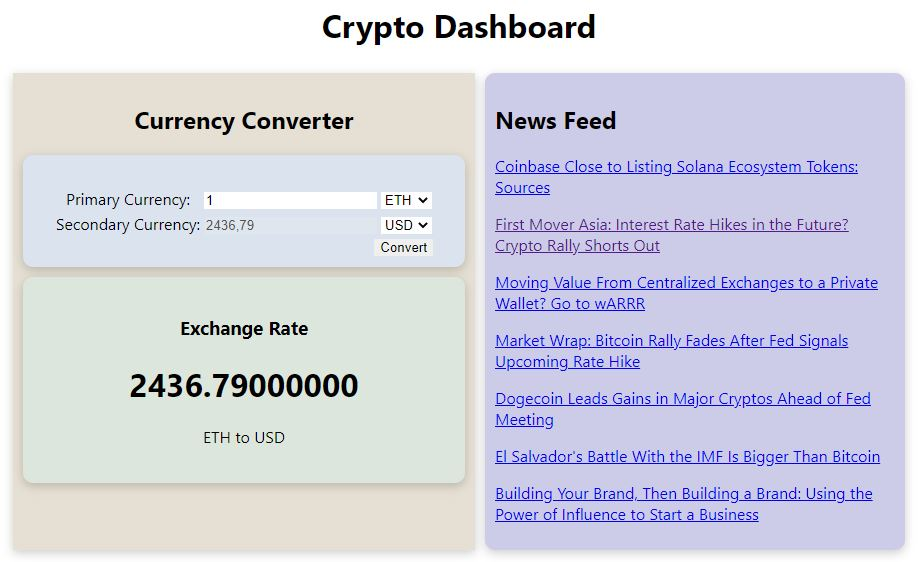

# Crypto Currency Dashboard - React App
This is the Crypto Currency Dashboard prototype based on request to third party APIs.\
Frontend created using ReactJS.\
Backend Express server added to secure environment variable.

## Technologies used:
- React JS
- Node JS

## ```npm``` libraries/packages used:
- axios
- express
- dotenv
- nodemon
- cors
- create-react-app

## API used:
[RapidAPI - Crypto News](https://rapidapi.com/ddeshon/api/crypto-news-live3/) - for getting News.\
[RapidAPI - Crypto News](https://rapidapi.com/alphavantage/api/alpha-vantage/) - for getting exchange rates.

## 
**I thank [@kubowania](https://github.com/kubowania) for idea & tutorial**\

## Dashboard View


##

# Getting Started with Create React App

This project was bootstrapped with [Create React App](https://github.com/facebook/create-react-app).

## Available Scripts

In the project directory, you can run:

### `npm run start:frontend`

Runs the app in the development mode.\
Open [http://localhost:3000](http://localhost:3000) to view it in your browser.

The page will reload when you make changes.\
You may also see any lint errors in the console.

### `npm run start:backend`
Runs the express server.\
Open [http://localhost:8000](http://localhost:8000) to check if all good, up and running

### `npm test`

Launches the test runner in the interactive watch mode.\
See the section about [running tests](https://facebook.github.io/create-react-app/docs/running-tests) for more information.

### `npm run build`

Builds the app for production to the `build` folder.\
It correctly bundles React in production mode and optimizes the build for the best performance.

The build is minified and the filenames include the hashes.\
Your app is ready to be deployed!

See the section about [deployment](https://facebook.github.io/create-react-app/docs/deployment) for more information.

